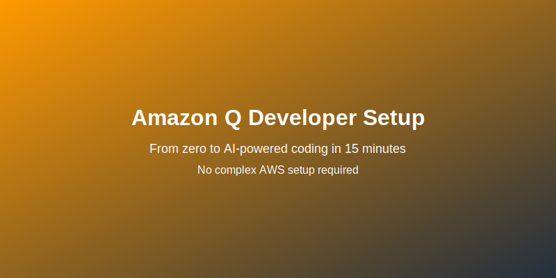
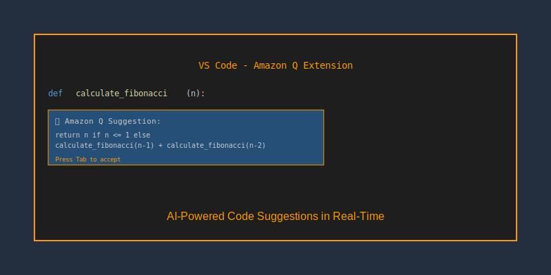
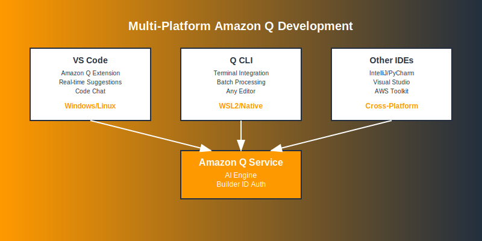

# Getting Amazon Q Working on Your Machine - The Real Developer's Guide


*From zero to AI-powered coding in 15 minutes - no complex AWS setup required*

Alright, let's be honest here. I've been coding for years, and when I first heard about Amazon Q, I thought "great, another AI tool that probably takes forever to set up." Boy, was I wrong about the setup part, but also wrong about how useful it actually is.

Most tutorials throw you into the deep end with AWS accounts and complex configurations. That's backwards. The smart way? Start with the free version that works in 5 minutes, then decide if you want the fancy stuff later.

Here's what actually worked for me, with zero fluff.

## Why Start with Free Amazon Q?

Look, I get it. "Free" usually means "barely functional." But Amazon Q's free tier is genuinely useful:

- Real AI code completions as you type
- Explains code you don't understand
- Finds security issues automatically
- Converts your plain English into working code
- Works in VS Code, IntelliJ, and other popular IDEs

The catch? You need something called a "Builder ID." Don't worry, it takes 2 minutes and costs nothing.

## Part 1: Getting Started (The Easy Way)

### Step 1: Create Your AWS Builder ID

This isn't an AWS account. It's just your developer identity for Amazon's AI tools. Think of it like a GitHub account, but for AWS developer services.

**Here's how:**

1. Go to https://profile.aws.amazon.com/
2. Click "Create AWS Builder ID"
3. Use your email (I recommend personal email over work email)
4. Verify your email
5. Fill out your profile

That's it. No credit card, no AWS account, no complex setup. You now have access to Amazon Q for free.

**Why personal email?** Builder IDs stick with you even if you change jobs. All your Q history and preferences stay with you.

### Step 2: Get Amazon Q Working in VS Code

This is where the magic happens. No command line tools, no configuration files, just install and go.

**Installation:**
1. Open VS Code
2. Hit Ctrl+Shift+X (Extensions)
3. Search "Amazon Q"
4. Install the official Amazon Q extension
5. Click "Sign in" and use your Builder ID

**Test it works:**
1. Create a new Python file
2. Start typing: `def calculate_fibonacci(`
3. Watch Amazon Q suggest the complete function
4. Press Tab to accept, or keep typing to see more options

If you see AI suggestions popping up, you're golden.

### Step 3: Your First AI Conversation

Here's where it gets interesting. Amazon Q isn't just autocomplete - you can actually chat with it about your code.

**Try this:**
1. Press Ctrl+I in VS Code (or click the Q icon)
2. Type: "Explain what this function does" and select some code
3. Or ask: "Write a function to validate email addresses"
4. Or: "Find potential security issues in this file"

The responses are surprisingly good. Not perfect, but genuinely helpful.

```
Block Diagram: Amazon Q Free Version Architecture

┌─────────────────┐    ┌──────────────────┐    ┌─────────────────┐
│   Your IDE      │    │   Amazon Q       │    │   AWS Builder   │
│   (VS Code)     │◄──►│   Service        │◄──►│   ID Profile    │
│                 │    │                  │    │                 │
│ • Code Editor   │    │ • AI Completions │    │ • Your Identity │
│ • Q Extension   │    │ • Code Analysis  │    │ • Free Tier     │
│ • Chat Interface│    │ • Security Scan  │    │ • No AWS Account│
└─────────────────┘    └──────────────────┘    └─────────────────┘
```

### What You Get for Free

Let me be specific about what the free version actually does:

**Code Completions:**
- Suggests entire functions based on your comments
- Completes repetitive code patterns
- Understands context from your existing code

**Code Explanations:**
- Select any code and ask "what does this do?"
- Get explanations in plain English
- Helpful for understanding unfamiliar libraries

**Security Scanning:**
- Automatically flags potential vulnerabilities
- Suggests fixes for common security issues
- Learns from your coding patterns

**Natural Language to Code:**
- "Create a REST API endpoint for user login"
- "Write a function to parse CSV files"
- "Generate unit tests for this class"


*Amazon Q providing real-time code suggestions and explanations in VS Code*

## Part 2: Level Up with Command Line Tools

The VS Code extension is great, but the command line interface gives you superpowers. Plus, it works with any editor.

### Why Install the CLI?

**More flexibility:**
- Works with Vim, Emacs, or any editor
- Batch process multiple files
- Integrate with your existing scripts
- Better for large codebases

**Advanced features:**
- Chat sessions that remember context
- File analysis and recommendations
- Project-wide code reviews

### Installing on Windows

**Option 1: Direct Download**
1. Go to https://aws.amazon.com/q/
2. Download the Windows installer
3. Run the installer
4. Open Command Prompt or PowerShell

**Option 2: Package Manager (if you have winget)**
```powershell
winget install Amazon.Q
```

**Verify it worked:**
```powershell
q --version
```

**Sign in:**
```powershell
q auth login
```

This opens your browser. Sign in with the same Builder ID you used in VS Code.

### Installing on WSL (Recommended for Developers)

**Why WSL?** If you're doing serious development on Windows, WSL gives you the best of both worlds. Better terminal, Linux tools, but still Windows.

**Install Q in WSL:**
```bash
# Download the Linux version
curl -Lo q.zip https://d2yblsmsllhfto.cloudfront.net/q/latest/q-linux-x64.zip

# Extract and install
unzip q.zip
sudo mv q /usr/local/bin/
chmod +x /usr/local/bin/q

# Verify installation
q --version

# Sign in
q auth login
```

**Test your setup:**
```bash
# Start a chat session
q chat

# Try asking something
"How do I handle exceptions in Python?"

# Exit with Ctrl+C or type 'exit'
```

```
Block Diagram: Complete Amazon Q Setup

┌─────────────────┐    ┌─────────────────┐    ┌─────────────────┐
│   Development   │    │   Amazon Q      │    │   Your Machine  │
│   Environment   │    │   Service       │    │                 │
│                 │    │                 │    │                 │
│ ┌─────────────┐ │    │ ┌─────────────┐ │    │ ┌─────────────┐ │
│ │ VS Code     │ │◄──►│ │ AI Engine   │ │    │ │ Windows     │ │
│ │ Extension   │ │    │ │             │ │    │ │ Native      │ │
│ └─────────────┘ │    │ └─────────────┘ │    │ └─────────────┘ │
│                 │    │                 │    │                 │
│ ┌─────────────┐ │    │ ┌─────────────┐ │    │ ┌─────────────┐ │
│ │ Q CLI       │ │◄──►│ │ Code        │ │    │ │ WSL2        │ │
│ │ Terminal    │ │    │ │ Analysis    │ │    │ │ Linux       │ │
│ └─────────────┘ │    │ └─────────────┘ │    │ └─────────────┘ │
│                 │    │                 │    │                 │
│ ┌─────────────┐ │    │ ┌─────────────┐ │    │ ┌─────────────┐ │
│ │ Other IDEs  │ │◄──►│ │ Security    │ │    │ │ Builder ID  │ │
│ │ IntelliJ    │ │    │ │ Scanner     │ │    │ │ Profile     │ │
│ └─────────────┘ │    │ └─────────────┘ │    │ └─────────────┘ │
└─────────────────┘    └─────────────────┘    └─────────────────┘
```

### Getting the Most from CLI

**Interactive Chat:**
```bash
q chat
```
This starts a conversation where Q remembers context. Much better than one-off questions.

**File Analysis:**
```bash
# Analyze a specific file
q chat --file app.py "Review this code for potential issues"

# Multiple files
q chat --file *.py "Find common patterns across these files"
```

**Project-wide Help:**
```bash
# In your project directory
q chat "Analyze this entire project and suggest improvements"

# Generate documentation
q chat "Create a README file for this project"
```

### Real-World Examples

**Debugging Help:**
```bash
q chat "This Python script crashes with 'KeyError'. Here's the code: [paste your code]"
```

**Code Generation:**
```bash
q chat "Write a Python function that connects to PostgreSQL and handles connection errors gracefully"
```

**Learning New Libraries:**
```bash
q chat "Show me how to use pandas to read a CSV file and filter rows where column 'age' > 25"
```

**Code Review:**
```bash
q chat --file myapp.py "Review this code for security vulnerabilities and performance issues"
```

## IDE Integration Beyond VS Code

### IntelliJ IDEA / PyCharm

1. Install "AWS Toolkit" plugin
2. Go to Settings → AWS Toolkit
3. Sign in with your Builder ID
4. Enable Amazon Q features

**What you get:**
- Code completions (similar to VS Code)
- Inline chat
- Security scanning
- Code explanations

### Other Editors

**Vim/Neovim:** Use the CLI integration
**Visual Studio:** AWS Toolkit available
**Sublime Text:** CLI integration works well
**Atom:** CLI integration

The CLI approach works with any editor since you can pipe code to it or use it in separate terminal sessions.


*Amazon Q working across different development environments and tools*

## Troubleshooting Common Issues

**"Builder ID login failed"**
- Double-check you're using the same email everywhere
- Try: `q auth logout` then `q auth login`
- Make sure you verified your email

**"No code suggestions in VS Code"**
- Restart VS Code after installing the extension
- Check the extension is enabled
- Make sure you're signed in (look for Q icon in status bar)

**"Command 'q' not found" (WSL)**
- Check the file is executable: `chmod +x /usr/local/bin/q`
- Verify it's in your PATH: `echo $PATH`
- Try: `which q` to see if it's found

**"Extension not working"**
- Disable and re-enable the Amazon Q extension
- Check VS Code is up to date
- Try signing out and back in

**"Slow responses"**
- Check your internet connection
- Try smaller code snippets
- Some complex requests take longer

## What's Next?

At this point, you should have:
- Amazon Q working in your IDE with real AI suggestions
- Command line access for advanced features
- A good understanding of what the free version can do

**Most developers stop here and are perfectly happy.** The free version handles 90% of daily coding tasks where AI helps.

**When might you want to upgrade to Pro?**
- You're working on large, complex projects
- You want AI agents that specialize in different tasks
- You need custom knowledge bases for your organization
- You want advanced security and compliance features

But honestly? Use the free version for a few weeks first. Get comfortable with AI-assisted coding. Then decide if you need the advanced stuff.

## Quick Reference

**Essential Commands:**
```bash
q auth login          # Sign in
q auth logout         # Sign out
q chat               # Start interactive session
q chat --file app.py # Analyze specific file
q --help             # Get help
```

**VS Code Shortcuts:**
- `Ctrl+I`: Open Q chat
- `Tab`: Accept AI suggestion
- `Esc`: Dismiss suggestion

**Getting Help:**
```bash
q chat "How do I [your question here]?"
```

## The Reality Check

**What Amazon Q does well:**
- Code completions that actually make sense
- Explaining unfamiliar code
- Generating boilerplate and repetitive code
- Finding obvious security issues
- Converting ideas into working code

**What it doesn't do:**
- Replace your brain (you still need to understand the code)
- Handle very complex architectural decisions
- Work perfectly with brand-new libraries
- Understand your specific business logic

**My honest take:** It's like having a smart junior developer looking over your shoulder. Sometimes brilliant, sometimes needs guidance, but generally helpful and gets better over time.

The free version is genuinely useful for daily development work. I use it for generating tests, explaining code I didn't write, and handling repetitive coding tasks.

Start here, get comfortable with AI-assisted development, then decide if you want to dive deeper into the advanced features.

That's the smart approach - learn to walk before you run.
