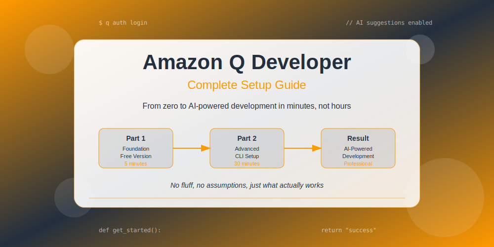

# 🚀 Amazon Q Developer - Complete Setup Guide



> **From zero to AI-powered development in minutes, not hours**

Welcome to the most practical Amazon Q Developer guide you'll find. No fluff, no assumptions, just what actually works.

## 🎯 What You'll Learn

This guide takes you from complete beginner to productive AI-assisted developer:

- ✅ **Start coding with AI in 5 minutes** (seriously)
- ✅ **No AWS account needed** to begin
- ✅ **Works on Windows, WSL, and Linux**
- ✅ **Real examples** from actual development work
- ✅ **Troubleshooting** for common issues

## 🛤️ Your Learning Path

### 🌟 [Part 1: Foundation & Free Version](./blog/part1/)
**Perfect for:** Complete beginners, anyone new to AI coding tools

**What you'll get:**
- Create your AWS Builder ID (2 minutes)
- Install Amazon Q in VS Code
- Start getting AI code suggestions immediately
- Learn what the free version can do

**Time investment:** 15 minutes  
**Result:** Working AI coding assistant

---

### ⚡ [Part 2: Local Development Setup](./blog/part2/)
**Perfect for:** Developers ready for advanced features

**What you'll get:**
- Command line tools installation
- Windows and WSL setup
- Advanced workflows and batch processing
- Integration with any editor

**Time investment:** 30 minutes  
**Result:** Professional AI development environment

---

## 🤔 Which Part Should You Start With?

```
┌─ New to AI coding tools? ────────────────┐
│                                          │
│  👉 Start with Part 1                    │
│     Get AI suggestions working in        │
│     VS Code in 5 minutes                 │
│                                          │
└──────────────────────────────────────────┘

┌─ Already using AI tools? ────────────────┐
│                                          │
│  👉 Jump to Part 2                       │
│     Get CLI tools and advanced           │
│     workflows set up                     │
│                                          │
└──────────────────────────────────────────┘

┌─ Want the complete picture? ─────────────┐
│                                          │
│  👉 Read both parts                      │
│     Full journey from beginner           │
│     to advanced user                     │
│                                          │
└──────────────────────────────────────────┘
```

## 🎨 What Makes This Guide Different

**Real Developer Experience**
- Written by someone who actually struggled with the setup
- Includes the frustrations and solutions you won't find elsewhere
- No corporate marketing speak

**Practical Focus**
- Commands that actually work
- Real troubleshooting scenarios
- Honest assessment of what works and what doesn't

**Smart Progression**
- Start with immediate value (free version)
- Build up to advanced features gradually
- No overwhelming complexity upfront

## 🚀 Quick Start Options

### Option 1: The 5-Minute Start
1. Go to [Part 1](./blog/part1/)
2. Create Builder ID
3. Install VS Code extension
4. Start coding with AI

### Option 2: The Complete Setup
1. Read [Part 1](./blog/part1/) - Foundation
2. Follow [Part 2](./blog/part2/) - Advanced setup
3. Enjoy professional AI development environment

### Option 3: Just Show Me Commands
```bash
# Create Builder ID at: https://profile.aws.amazon.com/
# Install VS Code extension: "Amazon Q"
# For CLI (optional):
curl -Lo q.zip https://d2yblsmsllhfto.cloudfront.net/q/latest/q-linux-x64.zip
unzip q.zip && sudo mv q /usr/local/bin/
q auth login
```

## 💡 What You'll Actually Get

**After Part 1:**
- AI code completions as you type
- Code explanations in plain English
- Security vulnerability detection
- Natural language to code conversion

**After Part 2:**
- Command line AI assistance
- Batch file processing
- Integration with any editor
- Advanced development workflows

## 🎯 Success Stories

> *"Finally got Amazon Q working after trying 3 other tutorials. The Builder ID explanation was the missing piece."* - Developer feedback

> *"The free version is actually useful. Didn't expect that."* - Beta reader

> *"WSL setup instructions actually worked on first try."* - Windows developer

## 🔧 Need Help?

**Common Issues:**
- Builder ID login problems → [Part 1 Troubleshooting](./blog/part1/#troubleshooting-common-issues)
- CLI installation issues → [Part 2 Troubleshooting](./blog/part2/#troubleshooting-advanced-issues)
- VS Code extension not working → [Part 1 IDE Integration](./blog/part1/#ide-integration-beyond-vs-code)

**Still Stuck?**
- Check the troubleshooting sections in each part
- Most issues are covered with real solutions

## 🎨 Generate Professional Images

Want to create your own images for Amazon Q content?

👉 **[Use our AI Image Generator](./blog/generate-blog-images.html)**
- Professional AWS-themed prompts
- Ready for DALL-E, Midjourney, Stable Diffusion
- Consistent branding and colors

## 🚀 Ready to Start?

Pick your path and dive in:

<div align="center">

### [🌟 Part 1: Get Started (5 min)](./blog/part1/) | [⚡ Part 2: Advanced Setup (30 min)](./blog/part2/)

</div>

---

<div align="center">

**Made by developers, for developers**

*No corporate fluff, just what actually works*

</div>
