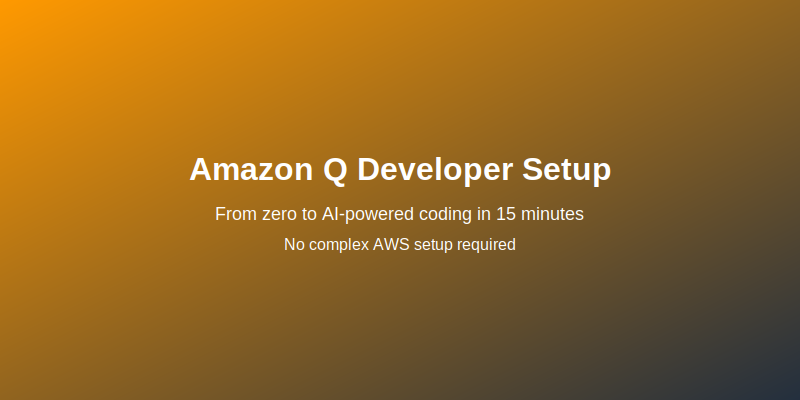
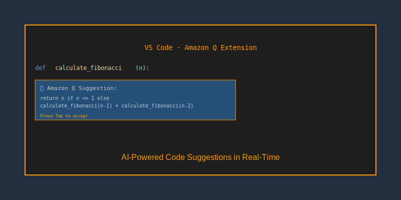

# Amazon Q Developer - Part 1: Foundation & Free Version


*From zero to AI-powered coding in 5 minutes - no AWS account required*

So you want to get Amazon Q working on your machine? Let's be honest here - most tutorials assume you know stuff that nobody actually tells you. I spent way too many hours figuring this out, so here's the real deal.

We're starting with the FREE version (which is actually pretty powerful), and you'll be getting AI code suggestions in about 5 minutes.

## Why Start with Free Amazon Q?

Look, I get it. "Free" usually means "barely functional." But Amazon Q's free tier is genuinely useful:

- Real AI code completions as you type
- Explains code you don't understand  
- Finds security issues automatically
- Converts your plain English into working code
- Works in VS Code, IntelliJ, and other popular IDEs

The catch? You need something called a "Builder ID." Don't worry, it takes 2 minutes and costs nothing.

## Step 1: Create Your AWS Builder ID

This isn't an AWS account. It's just your developer identity for Amazon's AI tools. Think of it like a GitHub account, but for AWS developer services.

**Here's how:**

1. Go to https://profile.aws.amazon.com/
2. Click "Create AWS Builder ID"
3. Use your email (I recommend personal email over work email)
4. Verify your email
5. Fill out your profile

That's it. No credit card, no AWS account, no complex setup. You now have access to Amazon Q for free.

**Why personal email?** Builder IDs stick with you even if you change jobs. All your Q history and preferences stay with you.

## Step 2: Get Amazon Q Working in VS Code

This is where the magic happens. No command line tools, no configuration files, just install and go.

**Installation:**
1. Open VS Code
2. Hit Ctrl+Shift+X (Extensions)
3. Search "Amazon Q"
4. Install the official Amazon Q extension
5. Click "Sign in" and use your Builder ID

**Test it works:**
1. Create a new Python file
2. Start typing: `def calculate_fibonacci(`
3. Watch Amazon Q suggest the complete function
4. Press Tab to accept, or keep typing to see more options

If you see AI suggestions popping up, you're golden.

## Step 3: Your First AI Conversation

Here's where it gets interesting. Amazon Q isn't just autocomplete - you can actually chat with it about your code.

**Try this:**
1. Press Ctrl+I in VS Code (or click the Q icon)
2. Type: "Explain what this function does" and select some code
3. Or ask: "Write a function to validate email addresses"
4. Or: "Find potential security issues in this file"

The responses are surprisingly good. Not perfect, but genuinely helpful.

```
Block Diagram: Amazon Q Free Version Architecture

┌─────────────────┐    ┌──────────────────┐    ┌─────────────────┐
│   Your IDE      │    │   Amazon Q       │    │   AWS Builder   │
│   (VS Code)     │◄──►│   Service        │◄──►│   ID Profile    │
│                 │    │                  │    │                 │
│ • Code Editor   │    │ • AI Completions │    │ • Your Identity │
│ • Q Extension   │    │ • Code Analysis  │    │ • Free Tier     │
│ • Chat Interface│    │ • Security Scan  │    │ • No AWS Account│
└─────────────────┘    └──────────────────┘    └─────────────────┘
```

## What You Get for Free

Let me be specific about what the free version actually does:

**Code Completions:**
- Suggests entire functions based on your comments
- Completes repetitive code patterns
- Understands context from your existing code

**Code Explanations:**
- Select any code and ask "what does this do?"
- Get explanations in plain English
- Helpful for understanding unfamiliar libraries

**Security Scanning:**
- Automatically flags potential vulnerabilities
- Suggests fixes for common security issues
- Learns from your coding patterns

**Natural Language to Code:**
- "Create a REST API endpoint for user login"
- "Write a function to parse CSV files"
- "Generate unit tests for this class"


*Amazon Q providing real-time code suggestions and explanations in VS Code*

## IDE Integration Beyond VS Code

### IntelliJ IDEA / PyCharm

1. Install "AWS Toolkit" plugin
2. Go to Settings → AWS Toolkit
3. Sign in with your Builder ID
4. Enable Amazon Q features

**What you get:**
- Code completions (similar to VS Code)
- Inline chat
- Security scanning
- Code explanations

### Other Editors

**Vim/Neovim:** Use the CLI integration (covered in Part 2)
**Visual Studio:** AWS Toolkit available
**Sublime Text:** CLI integration works well
**Atom:** CLI integration

## Troubleshooting Common Issues

**"Builder ID login failed"**
- Double-check you're using the same email everywhere
- Make sure you verified your email

**"No code suggestions in VS Code"**
- Restart VS Code after installing the extension
- Check the extension is enabled
- Make sure you're signed in (look for Q icon in status bar)

**"Extension not working"**
- Disable and re-enable the Amazon Q extension
- Check VS Code is up to date
- Try signing out and back in

## What's Next?

At this point, you should have:
- Amazon Q working in your IDE with real AI suggestions
- A good understanding of what the free version can do
- Experience with AI-assisted coding

**Most developers stop here and are perfectly happy.** The free version handles 90% of daily coding tasks where AI helps.

Ready for more advanced features? Check out [Part 2: Local Development Setup](../part2/README.md) to learn about CLI tools and advanced workflows.

## Quick Reference

**VS Code Shortcuts:**
- `Ctrl+I`: Open Q chat
- `Tab`: Accept AI suggestion
- `Esc`: Dismiss suggestion

**Getting Help:**
- Press Ctrl+I and ask: "How do I [your question here]?"

## The Reality Check

**What Amazon Q does well:**
- Code completions that actually make sense
- Explaining unfamiliar code
- Generating boilerplate and repetitive code
- Finding obvious security issues

**What it doesn't do:**
- Replace your brain (you still need to understand the code)
- Handle very complex architectural decisions
- Work perfectly with brand-new libraries

**My honest take:** It's like having a smart junior developer looking over your shoulder. Sometimes brilliant, sometimes needs guidance, but generally helpful.

The free version is genuinely useful for daily development work. Start here, get comfortable with AI-assisted development, then decide if you want more advanced features.

---

**Next:** [Part 2: Local Development Setup](../part2/README.md) - CLI tools, Windows/WSL setup, and advanced workflows

---

# Disclaimer
<details>

Please note that the entire repository is owned and maintained by [Varun Kumar Manik](https://www.linkedin.com/in/vkmanik/). While every effort has been made to ensure the accuracy and reliability of the information and resources provided in this repository, Varun Kumar Manik takes full responsibility for any errors or inaccuracies that may be present.

No One responsible for the content or materials provided in this repository and disclaims all liability for any issues, misunderstandings, or claims that may arise from the use of the information or materials provided. By using this repository, you acknowledge that Varun Kumar Manik is solely accountable for its content, and you agree to hold  harmless from any claims or liabilities that may arise as a result of your use or reliance on the information provided herein.

It is important to understand that this repository contains educational materials for a training course, and users are expected to apply their own judgment and discretion when utilizing the provided resources. Neither Varun Kumar Manik nor Simplilearn can guarantee specific results or outcomes from following the materials in this repository.

</details>

## About the Author

**Varun Kumar Manik** brings nearly **1.5 decades of experience** in cloud computing and DevOps practices. As an **AWS Ambassador for 6+ years**, Varun has been recognized by AWS for his contributions to the cloud community and expertise in AWS technologies.

🏆 **AWS Ambassador Profile**: [View on AWS Partners Portal](https://aws.amazon.com/tw/partners/ambassadors/?ams%23interactive-card-vertical%23pattern-data.filter=%257B%2522search%2522%253A%2522varun%2522%252C%2522filters%2522%253A%255B%255D%257D)

This guide represents real-world experience and practical knowledge gained from years of working with AWS services and helping developers adopt cloud-native development practices.

## Connect & Follow

For more info, please connect and follow me:

- Github: [https://github.com/manikcloud](https://github.com/manikcloud)
- LinkedIn: [https://www.linkedin.com/in/vkmanik/](https://www.linkedin.com/in/vkmanik/)
- Email: [varunmanik1@gmail.com](mailto:varunmanik1@gmail.com)
- Facebook: [https://www.facebook.com/cloudvirtualization/](https://www.facebook.com/cloudvirtualization/)
- YouTube: [https://bit.ly/32fknRN](https://bit.ly/32fknRN)
- Twitter: [https://twitter.com/varunkmanik](https://twitter.com/varunkmanik)
